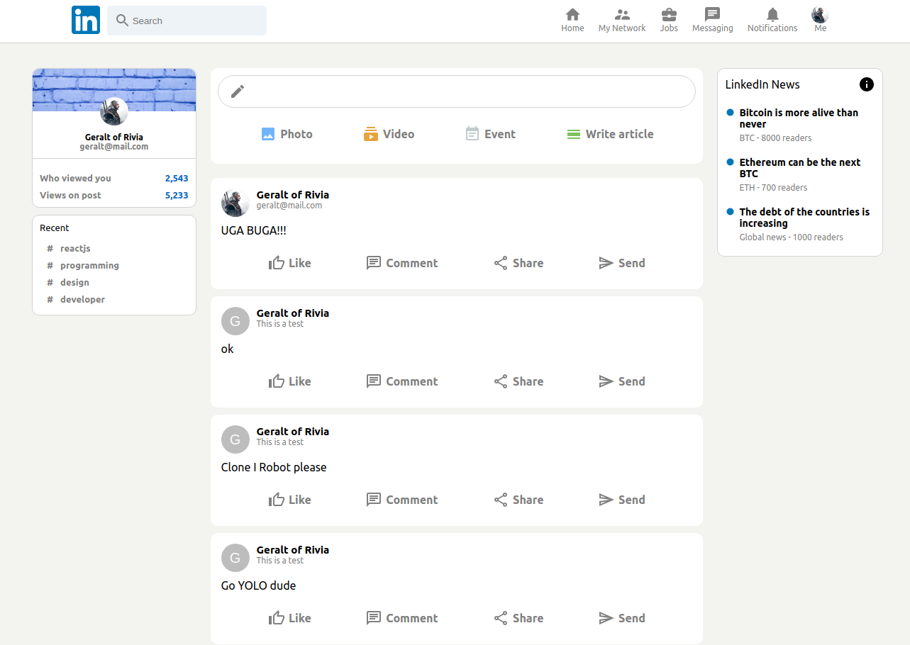

# Linkedin Clone

Linkedin clone is an implementation of [Linkedin](https://www.linkedin.com/feed/) that comprehend the following features:

  * Registration, login and logout actions;
  * Feed page with the functionality to create posts.

Tools used in the development:

  * React (project created with [create-react-app](https://create-react-app.dev/docs/getting-started/));
  * Redux;
  * Firebase.

This project has study purposes only.

## How to run this app?

In the project folder:

  * Run `npm install`;
  * Configure you [Firebase](https://firebase.google.com/?hl=pt-br) project, including authentication and DB;
  * Create your `.env` based on `.env.example`, and fill it with your Firebase project settings;
  * Run `npm start`.

## How to deploy this app?

The following instructions are a suggestion of how to configure you deploy if you just wanna do that for testing and have an URL to share.

To deploy your app you need to have [Firebase](https://www.npmjs.com/package/firebase) installed.

  * Run `npm run build`;
  * Login in your Firebase account with `firebase login`;
  * Run `firebase init`. You should select your project through the options, type to use `build` as your *public directory*, and select to configure as an SPA;
  * Run `npm deploy`.

